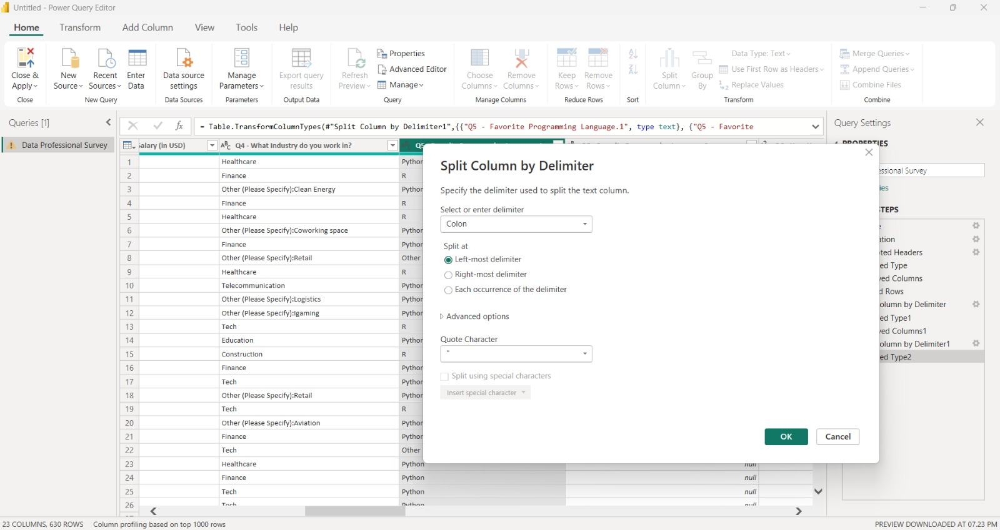
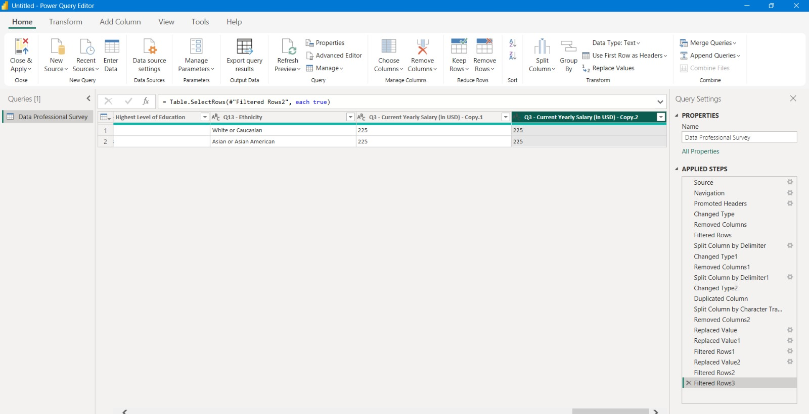
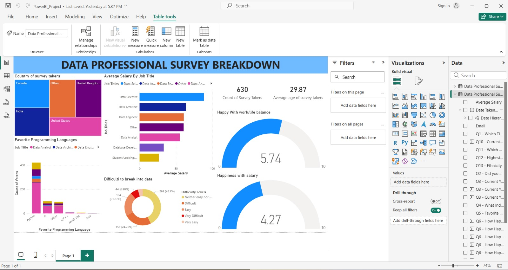

# Power BI – Data Professional Survey Dashboard

## Project Overview
This project is an interactive Power BI dashboard created to analyze survey data
from data professionals. The project focuses not only on visualization but also
on proper data cleaning and transformation using Power Query to ensure accurate
and meaningful insights.

## Objectives
- Analyze survey data of data professionals
- Compare average salary across job roles
- Identify popular programming languages
- Understand difficulty in entering the data field
- Measure happiness with salary and work-life balance
- Perform data cleaning and preprocessing before analysis

## Tools & Technologies
- Microsoft Power BI
- Power Query Editor
- Microsoft Excel
- Data Cleaning & Data Visualization

## Dataset
- File Name: **Power BI - Final Project.xlsx**
- Type: Survey dataset of data professionals

## Data Cleaning & Transformation (Power Query)
The following data preparation steps were performed in **Power Query Editor**:

- Removed unnecessary and irrelevant columns
- Filtered rows to eliminate null and invalid values
- Changed data types for salary, text, and categorical fields
- Split columns using delimiters (e.g., separating values after “Other:”)
- Cleaned inconsistent values in fields like:
  - Industry
  - Programming Language
  - Salary
- Duplicated and transformed columns where required for analysis
- Applied multiple filtering and replacement steps to standardize data

These steps ensured the dataset was clean, structured, and ready for analysis.

## Screenshots

### Power Query – Data Cleaning

### Dashboard View

## Dashboard Features
- Country-wise distribution of survey takers
- Average salary by job title
- Favorite programming languages
- Difficulty to break into the data profession
- Happiness with salary and work-life balance indicators

## How to Use
1. Download or clone this repository
2. Open `PowerBI_Project.pbix` in Microsoft Power BI Desktop
3. Ensure the Excel dataset is in the same folder
4. Click **Refresh** to load cleaned data

## Author
**Vaishnavi Samadhan Raut**

## Purpose
Academic project created to demonstrate data cleaning, analysis,
and visualization skills using Power BI.
